# java-concurrency-patterns
Java concurrency patterns for educational purposes

### Examples:

[Odd Even printer simple example](https://github.com/alxkm/java-concurrency/blob/main/src/main/java/ua/com/alxkm/examples/oddevenprinter/OddEvenPrinterExample.java)

[Odd Even printer another version example](https://github.com/alxkm/java-concurrency/blob/main/src/main/java/ua/com/alxkm/examples/oddevenprinter/OddEvenPrinterExample.java)

[Thread race condition example](https://github.com/alxkm/java-concurrency/blob/main/src/main/java/ua/com/alxkm/examples/racecondition/AccountExample.java)

[Philosopher with lock example](https://github.com/alxkm/java-concurrency/blob/main/src/main/java/ua/com/alxkm/examples/philosopher/PhilosopherWithLock.java)

[Philosopher with semaphore example](https://github.com/alxkm/java-concurrency/blob/main/src/main/java/ua/com/alxkm/examples/philosopher/PhilosopherWithSemaphore.java)

[BlockingQueue example](https://github.com/alxkm/java-concurrency/blob/main/src/main/java/ua/com/alxkm/examples/queue/BlockingQueueExample.java)

[CustomBlockingQueue pattern](https://github.com/alxkm/java-concurrency/blob/main/src/main/java/ua/com/alxkm/patterns/customblockingqueue/CustomBlockingQueue.java)

[ExecutorService example](https://github.com/alxkm/java-concurrency/blob/main/src/main/java/ua/com/alxkm/examples/executorservice/ExecutorServiceExample.java)

[Double check locking pattern](https://github.com/alxkm/java-concurrency/blob/main/src/main/java/ua/com/alxkm/patterns/doublechecklocking/Singleton.java)

[MultithreadedContext pattern](https://github.com/alxkm/java-concurrency/blob/main/src/main/java/ua/com/alxkm/patterns/multithreadedcontext/MultithreadedContext.java)

[ReentrantReadWriteLockCounter pattern](https://github.com/alxkm/java-concurrency/blob/main/src/main/java/ua/com/alxkm/patterns/readwritelock/ReentrantReadWriteLockCounter.java)

[Barrier pattern](https://github.com/alxkm/java-concurrency/blob/main/src/main/java/ua/com/alxkm/patterns/barrier/BarrierExample.java)

[PhaserExample pattern](https://github.com/alxkm/java-concurrency/blob/main/src/main/java/ua/com/alxkm/patterns/phaser/PhaserExample.java)

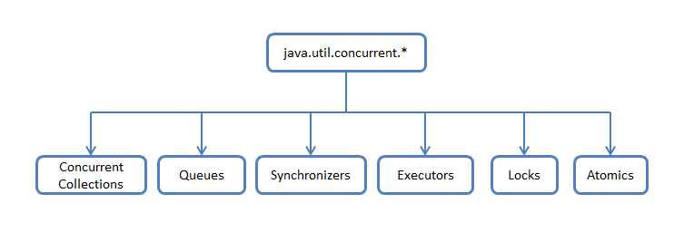

**Concurrent Collections** are a set of collections designed to operate more efficiently in multithreaded environments compared to the standard universal collections from the java.util package. Instead of using the basic Collections.synchronizedList wrapper, which blocks access to the entire collection, these collections utilize locks on data segments or employ wait-free algorithms to optimize parallel data reading and processing.

**Queues** — non-blocking and blocking queues with multithreading support. Non-blocking queues are designed for speed and work without blocking threads. Blocking queues are used when it is necessary to "slow down" the "Producer" or "Consumer" threads if some conditions are not met, for example, the queue is empty or full, or there is no free "Consumer".

**Synchronizers** are auxiliary utilities for synchronizing threads. They are a powerful weapon in "parallel" computing.

**Executors** - contains excellent frameworks for creating thread pools, scheduling asynchronous tasks and obtaining results.

**Locks** are alternative and more flexible thread synchronization mechanisms compared to the basic synchronized, wait, notify, notifyAll.

**Atomics** — classes with support for atomic operations on primitives and references.

# Concurrent Collections

### CopyOnWrite collections

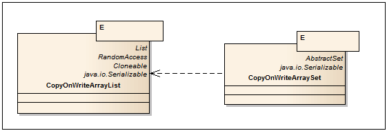

The name is self-explanatory. All modification operations on the collection (add, set, remove) result in the creation of a new copy of the internal array. This ensures that when an iterator traverses the collection, a ConcurrentModificationException will not be thrown. It is important to note that only references to objects are copied during the array copy (shallow copy), meaning that access to the fields of elements is not thread-safe. CopyOnWrite collections are particularly useful when write operations are infrequent, such as when implementing a listener subscription mechanism and iterating through the listeners.

**CopyOnWriteArrayList<E>** — A thread-safe analogue of ArrayList, implemented with the CopyOnWrite algorithm.

**Additional methods and constructor**

**CopyOnWriteArrayList(E[] toCopyIn)** - Constructor accepting an array as input.
**int indexOf(E e, int index)** - Returns the index of the first occurrence of the specified element, starting the search from the given index.
**int lastIndexOf(E e, int index)** - Returns the index of the last occurrence of the specified element when searching backward, starting from the given index.
**boolean addIfAbsent(E e)** - Adds an element to the collection if it is not already present. The equality of elements is determined using the equals method.
**int addAllAbsent(Collection<? extends E> c)** - Adds elements from the specified collection to this collection if they are not already present. Returns the number of elements added.

**CopyOnWriteArraySet<E>** — Implementation of the Set interface, using CopyOnWriteArrayList as a basis. Unlike CopyOnWriteArrayList, there are no additional methods.

### Examples:

[ConcurrentSkipListSetExample class demonstrates the usage of ConcurrentSkipListSet](https://github.com/alxkm/java-concurrency-patterns/blob/main/src/main/java/ua/com/alxkm/patterns/collections/ConcurrentSkipListSetExample.java)
[CopyOnWriteArrayListExample class demonstrates the usage of CopyOnWriteArrayList](https://github.com/alxkm/java-concurrency-patterns/blob/main/src/main/java/ua/com/alxkm/patterns/collections/CopyOnWriteArrayListExample.java)

# Scalable Maps

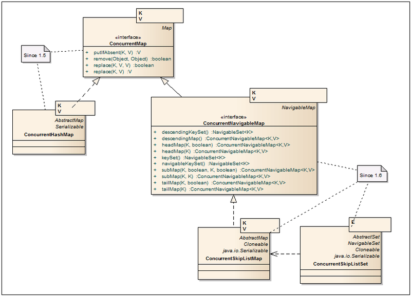

Improved implementations of HashMap, TreeMap with better support for multithreading and scalability.

**ConcurrentMap<K, V>** — An interface that extends Map with several additional atomic operations.

**Additional methods**

**V putIfAbsent(K key, V value)** Inserts a new key-value pair into the collection if the specified key is not already present. It returns the previous value associated with the given key, if any.

**boolean remove(Object key, Object value)** Removes a key-value pair from the Map only if the specified key is associated with the specified value. It returns true if the element was successfully removed.

**boolean replace(K key, V oldValue, V newValue)** Replaces the old value with the new one for the given key, only if the current value matches the specified old value. It returns true if the value was successfully replaced.

**V replace(K key, V value)**: Replaces the value for the given key with the new one, if the key is associated with any value. It returns the previous value associated with the key.

**ConcurrentHashMap<K, V>** — Unlike Hashtable and synchronized blocks on HashMap, data is represented as segments, broken down by key hashes. As a result, access to data is locked by segments, not by a single object. In addition, iterators represent data for a specific time slice and do not throw ConcurrentModificationException. More details ConcurrentHashMap

### Additional constructor

**ConcurrentHashMap(int initialCapacity, float loadFactor, int concurrencyLevel)** - The third parameter in the constructor represents the anticipated number of concurrent writing threads, with a default value of 16. This parameter significantly impacts the collection's memory footprint and performance.

**ConcurrentNavigableMap<K,V>** - This interface extends the NavigableMap interface and mandates that objects implementing ConcurrentNavigableMap are used as return values. All iterators provided by this interface are designated as safe for use and are programmed not to throw ConcurrentModificationException.

**ConcurrentSkipListMap<K, V>** - This class serves as a thread-safe equivalent of TreeMap. It organizes data based on keys and ensures an average performance of log(N) for operations like containsKey, get, put, remove, and similar operations.

**ConcurrentSkipListSet<E>** - This class implements the Set interface and is built upon ConcurrentSkipListMap for thread-safe set operations.

### Examples:

[ConcurrentHashMapExample class demonstrates the usage of the ConcurrentHashMap](https://github.com/alxkm/java-concurrency-patterns/blob/main/src/main/java/ua/com/alxkm/patterns/collections/ConcurrentHashMapExample.java)
[ConcurrentSkipListMapExample class demonstrates the usage of ConcurrentSkipListMap](https://github.com/alxkm/java-concurrency-patterns/blob/main/src/main/java/ua/com/alxkm/patterns/collections/ConcurrentSkipListMapExample.java)

# Queues

### Non-Blocking Queues

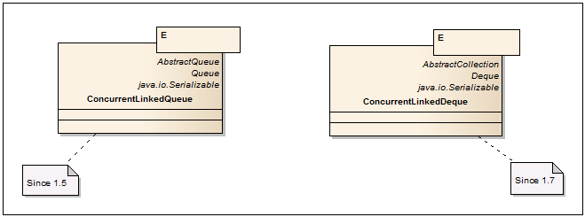

Thread-safe and non-blocking queue implementations based on linked nodes.

**ConcurrentLinkedQueue<E>** — This implementation utilizes the wait-free algorithm devised by Michael & Scott, optimized to work efficiently with the garbage collector. Built on CAS, this algorithm ensures high-speed operations. However, it's worth noting that the size() method may incur significant overhead if called frequently, so it's advisable to minimize its usage.

**ConcurrentLinkedDeque<E>** — Deque, pronounced as “Deck”, stands for Double-ended queue, indicating that data can be added to and removed from both ends. Consequently, this class supports both FIFO (First In First Out) and LIFO (Last In First Out) modes of operation. In practical scenarios, ConcurrentLinkedDeque should be employed only if LIFO functionality is indispensable, as its bidirectional nature causes a 40% performance loss compared to ConcurrentLinkedQueue.

### Blocking Queues
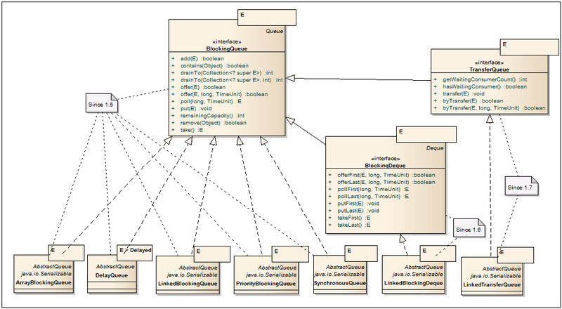

**BlockingQueue<E>** — When managing large data streams with queues, ConcurrentLinkedQueue alone may not suffice. If threads clearing the queue fail to keep up with the data influx, it could lead to memory exhaustion or significant IO/Net overload, causing a performance drop until system failure due to timeouts or lack of free descriptors. To address such scenarios, a queue with customizable size or conditional locking is necessary. This is where the BlockingQueue interface comes in, providing access to a range of useful classes. Besides setting the queue size, new methods have been introduced to handle underfilling or overflowing queues differently. For instance, when adding an element to a full queue, one method throws an IllegalStateException, another returns false, another blocks the thread until space is available, and yet another blocks the thread with a timeout, returning false if space is still unavailable. It's important to note that blocking queues don't support null values since null is used in the poll method as a timeout indicator.

**ArrayBlockingQueue<E>** — A blocking queue implemented using a traditional ring buffer. In addition to the queue size, it allows control over lock fairness. If fair=false (default), thread order is not guaranteed. Refer to the description of ReentrantLock for more on "fairness."

**DelayQueue<E extends Delayed>** — A specialized class that retrieves elements from the queue only after a delay specified in each element via the getDelay method of the Delayed interface.

**LinkedBlockingQueue<E>** — A blocking queue implemented with linked nodes, using the "two lock queue" algorithm: one lock for adding, another for removing elements. Compared to ArrayBlockingQueue, this class offers higher performance due to two locks, but consumes more memory. The queue size is set via the constructor and defaults to Integer.MAX_VALUE.

**PriorityBlockingQueue<E>** — A thread-safe wrapper over PriorityQueue. When inserting an element, its position in the queue is determined by the Comparator logic or the Comparable interface implemented in the elements. The smallest element is dequeued first.

**SynchronousQueue<E>** — Operates on a "one in, one out" principle. Each insert operation blocks the producer thread until the consumer thread retrieves an element, and vice versa; the consumer waits until the producer inserts an element.

**BlockingDeque<E>** — An interface providing additional methods for a bidirectional blocking queue, allowing data insertion and retrieval from both ends of the queue.

**LinkedBlockingDeque<E>** — A bidirectional blocking queue implemented with linked nodes, essentially a doubly linked list with a single lock. The queue size is specified via the constructor and defaults to Integer.MAX_VALUE.

**TransferQueue<E>** — This interface is interesting because it allows blocking the producer thread when adding an element until a consumer thread retrieves an element from the queue. The blocking can include a timeout or a check for waiting consumers, enabling synchronous and asynchronous message transfer mechanisms.

**LinkedTransferQueue<E>** — An implementation of TransferQueue based on the Dual Queues with Slack algorithm, utilizing CAS and thread parking extensively when idle.

### Examples:

[Blocking Queue Producer-Consumer Example](https://github.com/alxkm/java-concurrency-patterns/blob/main/src/main/java/ua/com/alxkm/patterns/collections/BlockingQueueSimpleExample.java)

# Synchronizers
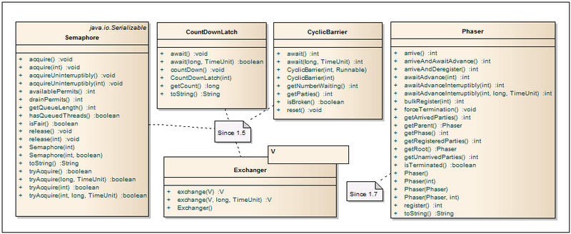

This section introduces classes for active thread management:

**Semaphore** - Typically used to limit the number of threads accessing hardware resources or a file system. A counter controls access to a shared resource. If the counter is greater than zero, access is granted, and the counter is decremented. If the counter is zero, the current thread is blocked until another thread releases the resource. The number of permits and the "fairness" of thread release are specified via the constructor. The challenge with semaphores is setting the number of permits, often depending on hardware capabilities.

**CountDownLatch** - Allows one or more threads to wait until a specific number of operations in other threads are completed. For example, threads calling the latch's await method (with or without a timeout) will block until another thread completes initialization and calls the countDown method. This method decrements the count. When the counter reaches zero, all waiting threads proceed, and subsequent await calls pass without waiting. The count is one-time and cannot be reset.

**CyclicBarrier** - Used to synchronize a set number of threads at a common point. The barrier is reached when N threads call the await method and block. The counter then resets, and waiting threads are released. Optionally, a Runnable task can be executed before threads are unblocked and the counter is reset.

**Exchanger<V>** - Facilitates the exchange of objects between two threads, supporting null values for single object transfers or as a simple synchronizer. The first thread calling the exchange method blocks until the second thread calls the same method. The threads then exchange values and proceed.

**Phaser** - An advanced barrier for thread synchronization, combining features of CyclicBarrier and CountDownLatch. The number of threads is dynamic and can change. The class can be reused and allows threads to report readiness without blocking.

# Executors

Here, we reach the most extensive section of the package. This part covers interfaces for executing asynchronous tasks with the capability of receiving results via the Future and Callable interfaces. Additionally, it includes services and factories for creating thread pools such as ThreadPoolExecutor, ScheduledThreadPoolExecutor, and ForkJoinPool. To enhance comprehension, we will break down the interfaces and classes into smaller, more manageable parts.
### Future and Callable

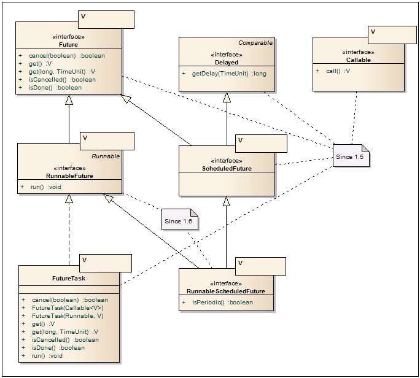

**Future<V>** — This is a useful interface for obtaining the results of an asynchronous operation. The key method is get, which blocks the current thread (with or without a timeout) until the asynchronous operation completes in another thread. Additional methods are available for canceling the operation and checking its current status. The FutureTask class often implements this interface.

**RunnableFuture<V>** — While Future serves as a Client API interface, the RunnableFuture interface is used to start the asynchronous operation. The successful completion of the run() method marks the asynchronous operation as complete, allowing the results to be retrieved via the get method.

**Callable<V>** — This is an extended version of the Runnable interface for asynchronous operations. It allows returning a typed value and throwing a checked exception. Although it lacks a run() method, many java.util.concurrent classes support it along with Runnable.

**FutureTask<V>** — This class implements the Future and RunnableFuture interfaces. It accepts an asynchronous operation as input in the form of Runnable or Callable objects. The FutureTask class is designed to be launched in a worker thread, for example, via new Thread(task).start(), or through a ThreadPoolExecutor. The results of the asynchronous operation are retrieved using the get(...) method.

**Delayed** — This interface is used for asynchronous tasks that should start in the future, as well as in DelayQueue. It allows setting the time before the start of an asynchronous operation.

**ScheduledFuture<V>** — A marker interface that combines the functionalities of Future and Delayed.

**RunnableScheduledFuture<V>** — An interface that combines RunnableFuture and ScheduledFuture. It also allows specifying whether the task is one-time or should be launched at a specified frequency.

### Executor Services

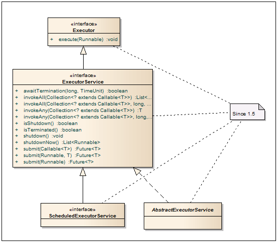

**Executor** — This is the fundamental interface for classes that execute Runnable tasks. It decouples the task submission process from the execution mechanism.

**ExecutorService** — An interface that defines a service for executing Runnable or Callable tasks. The submit methods take a task as a Callable or Runnable and return a Future through which the result can be obtained. The invokeAll methods handle lists of tasks, blocking the thread until all tasks in the provided list are completed or the specified timeout expires. The invokeAny methods block the calling thread until any one of the passed tasks completes. The interface also includes methods for graceful shutdown. Once the shutdown method is called, the service will no longer accept new tasks and will throw a RejectedExecutionException if an attempt is made to submit a task.

**ScheduledExecutorService** — This interface extends ExecutorService by adding capabilities for scheduling tasks to be executed after a delay or periodically.

**AbstractExecutorService** — An abstract class that serves as a base for building an ExecutorService. It provides the basic implementation of the submit, invokeAll, and invokeAny methods. Classes such as ThreadPoolExecutor, ScheduledThreadPoolExecutor, and ForkJoinPool inherit from this class.

### Examples:

[AbstractExecutorServiceExample Demonstrates the usage of AbstractExecutorService in a custom ExecutorService implementation](https://github.com/alxkm/java-concurrency-patterns/blob/main/src/main/java/ua/com/alxkm/patterns/executors/AbstractExecutorServiceExample.java)
[CompletionServiceExample Demonstrates the usage of ExecutorCompletionService](https://github.com/alxkm/java-concurrency-patterns/blob/main/src/main/java/ua/com/alxkm/patterns/executors/CompletionServiceExample.java)
[ExecutorsExample Demonstrates the usage of Executors utility class to create thread pools](https://github.com/alxkm/java-concurrency-patterns/blob/main/src/main/java/ua/com/alxkm/patterns/executors/ExecutorsExample.java)
[ScheduledThreadPoolExecutorExample Demonstrates the usage of ScheduledThreadPoolExecutor to schedule tasks](https://github.com/alxkm/java-concurrency-patterns/blob/main/src/main/java/ua/com/alxkm/patterns/executors/ScheduledThreadPoolExecutorExample.java)
[ThreadPoolExecutorExample Demonstrates the usage of ThreadPoolExecutor to execute tasks](https://github.com/alxkm/java-concurrency-patterns/blob/main/src/main/java/ua/com/alxkm/patterns/executors/ThreadPoolExecutorExample.java)

# ThreadPoolExecutor & Factory

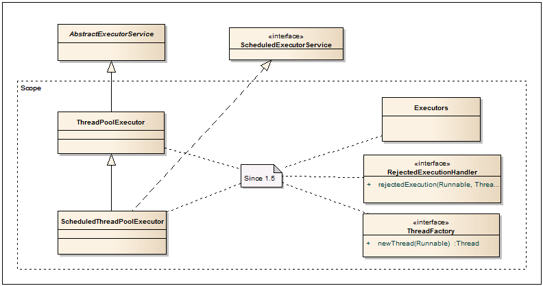

**ThreadPoolExecutor** — A highly versatile and essential class used to execute asynchronous tasks within a thread pool. This approach minimizes the overhead associated with creating and terminating threads. By maintaining a fixed maximum number of threads in the pool, it ensures predictable application performance. It is generally recommended to create this pool using one of the factory methods provided by the Executors class. However, if the standard configurations are insufficient, all key parameters of the pool can be set via constructors or setters. For more details, refer to the relevant documentation.

**ScheduledThreadPoolExecutor** — In addition to the methods of ThreadPoolExecutor, this class allows tasks to be scheduled for execution after a specific delay or at a fixed rate, enabling the implementation of a timer service based on this class.

**ThreadFactory** — By default, ThreadPoolExecutor uses the standard thread factory obtained through Executors.defaultThreadFactory(). If additional customization is needed, such as setting thread priority or naming threads, you can implement this interface and pass it to ThreadPoolExecutor.

**RejectedExecutionHandler** — Defines a handler for tasks that cannot be executed by ThreadPoolExecutor for various reasons, such as a lack of available threads or the service being shut down. The ThreadPoolExecutor class includes several standard implementations: CallerRunsPolicy — runs the task in the calling thread; AbortPolicy — throws an exception; DiscardPolicy — silently discards the task; DiscardOldestPolicy — removes the oldest unexecuted task from the queue and retries adding the new task.

# Fork Join

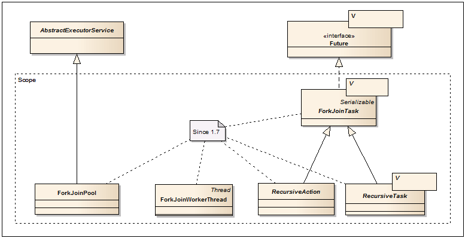

Java 1.7 introduces a new Fork Join framework for solving recursive problems using divide and conquer or Map Reduce algorithms.

Thus, by dividing into parts, it is possible to achieve their parallel processing in different threads. To solve this problem, you can use the usual ThreadPoolExecutor, but due to frequent context switching and tracking of execution control, all this does not work very effectively. Here, the Fork Join framework comes to our aid, which is based on the work-stealing algorithm. It reveals itself best in systems with a large number of processors. You can read more in the blog here or in Doug Lea's publication. You can read about performance and scalability here.

**ForkJoinPool** — The main entry point for initiating root (main) ForkJoinTask tasks. Subtasks are started using methods of the task being forked. By default, the thread pool is created with a number of threads equal to the number of processors (cores) available to the JVM.

**ForkJoinTask** — The base class for all Fork/Join tasks. Key methods include: fork() — adds a task to the queue of the current ForkJoinWorkerThread for asynchronous execution; invoke() — executes a task in the current thread; join() — waits for the subtask to complete and returns the result; invokeAll(…) — combines the previous three operations, executing two or more tasks at once; adapt(…) — creates a new ForkJoinTask from Runnable or Callable objects.

**RecursiveTask** — An abstract class derived from ForkJoinTask, requiring the implementation of the compute method, which performs the asynchronous operation.

**RecursiveAction** — Similar to RecursiveTask but does not return a result.

**ForkJoinWorkerThread** — Used as the default implementation in ForkJoinPool. Optionally, it can be extended to override worker thread initialization and completion methods.

# Completion Service

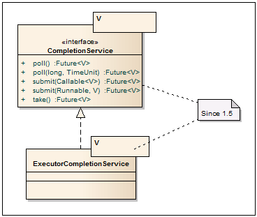

**CompletionService** — An interface that separates the submission of asynchronous tasks from the retrieval of their results. The submit methods are used to add tasks, while the take method (blocking) and poll method (non-blocking) are used to obtain the results of completed tasks.

**ExecutorCompletionService** — A wrapper around any class that implements the Executor interface, such as ThreadPoolExecutor or ForkJoinPool. It is primarily used to abstract the task submission and execution monitoring process. If tasks are completed, their results can be retrieved; otherwise, the take method will wait for completion. The default service uses LinkedBlockingQueue, but any BlockingQueue implementation can be used.

# Locks

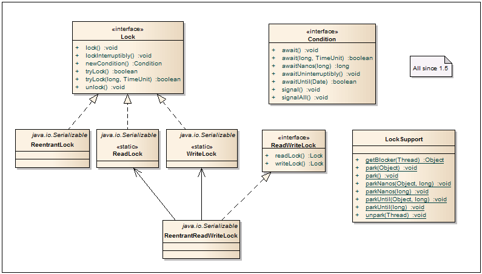

**Condition** — An interface that provides alternative methods to the traditional wait/notify/notifyAll methods. A condition object is typically obtained from a lock using the lock.newCondition() method, allowing multiple wait/notify sets for a single object.

**Lock** — A fundamental interface in the lock framework that offers a more flexible approach to controlling access to resources or blocks compared to using synchronized. When using multiple locks, the release order can be arbitrary, and it provides an option to follow an alternative scenario if the lock is already held by another thread.

**ReentrantLock** — A reentrant lock that allows only one thread to enter a protected block at a time. This class supports both "fair" and "non-fair" thread locking. With "fair" locking, threads are released in the order they called lock(). With "unfair" locking, the release order is not guaranteed, but it operates faster. By default, "unfair" locking is used.

**ReadWriteLock** — An interface for creating read/write locks. These locks are particularly useful when the system has many read operations and few write operations.

**ReentrantReadWriteLock** — Commonly used in multithreaded services and caches, providing a significant performance improvement over synchronized blocks. This class operates in two mutually exclusive modes: multiple readers can read data simultaneously, while only one writer can write data at a time.

**ReentrantReadWriteLock.ReadLock** — A read lock for readers, obtained via readWriteLock.readLock().

**ReentrantReadWriteLock.WriteLock** — A write lock for writers, obtained via readWriteLock.writeLock().

**LockSupport** — Designed for creating classes with locks. It includes methods for parking threads, serving as replacements for the deprecated Thread.suspend() and Thread.resume() methods.

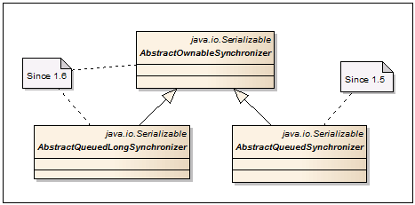

**AbstractOwnableSynchronizer** — A base class designed for creating synchronization mechanisms. It includes a simple getter/setter pair for storing and accessing an exclusive thread that can interact with the data.

**AbstractQueuedSynchronizer** — This class serves as the foundation for synchronization mechanisms in FutureTask, CountDownLatch, Semaphore, ReentrantLock, and ReentrantReadWriteLock. It can also be used to develop new synchronization mechanisms that rely on a single atomic integer value.

**AbstractQueuedLongSynchronizer** — A variant of AbstractQueuedSynchronizer that supports operations on an atomic long value.

# Atomics

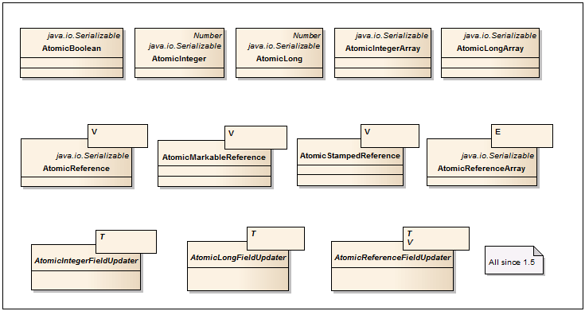

**AtomicBoolean, AtomicInteger, AtomicLong, AtomicIntegerArray, AtomicLongArray** — When you need to synchronize access to a simple int variable in a class, you can use synchronized constructs, or volatile with atomic set/get operations. However, the new Atomic* classes offer an even better solution. These classes use CAS (Compare-And-Swap) operations, which are faster than synchronization with synchronized or volatile. Additionally, they provide methods for atomic addition, increment, and decrement.

**AtomicReference** — This class allows for atomic operations on an object reference.

**AtomicMarkableReference** — This class supports atomic operations on a pair of fields: an object reference and a boolean flag (true/false).

**AtomicStampedReference** — This class supports atomic operations on a pair of fields: an object reference and an integer value.

**AtomicReferenceArray** — An array of object references that can be updated atomically.

**AtomicIntegerFieldUpdater, AtomicLongFieldUpdater, AtomicReferenceFieldUpdater** — These classes allow for atomic updates of fields by their names using reflection. The field offsets for CAS are determined in the constructor and cached, so the performance impact of reflection is minimal.
